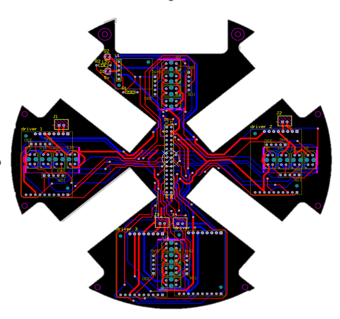

# RCJ2024-Soccer-PCBs

This repository contains all the custom PCB designs created for my RoboCup Junior 2024 soccer robot. The robot features a fully custom electronics stack built from the ground up, focusing on simplicity and reliability.

---

## 🧠 What is this?

In 2024, me and 3 other students decided to join the **RCJ 2024 Soccer Open**. I took the task of designing the electrical system. I designed and assembled two custom-made dual-layer printed circuit boards for our robot.

---

## 🔧 PCB 1 (Lower PCB) 

This PCB handles:
- **Line detection** using 16 TCRT5000 IR sensors, accompanied by resistor arrays to drive the LEDs and bias the signals.
- **Motor driving** using 4 VNH5019 carrier PCBs from Pololu.
- A **40-pin dual-row IDC slot** for an interconnect ribbon that links it to the other board.

---

## 🧠 PCB 2 (Upper PCB)

This PCB handles the robot control system and includes:
- An **Arduino Mega2560 Pro** embedded into the PCB.
- **Power regulators** and **decoupling capacitors**.
- A **linear solenoid boost and drive circuit**.
- **UART communication** with an OpenMV Cam H7+.
- **Bluetooth communication** via an HC-05 module.
- An **off-the-shelf ESC (BlueRobotics Basic ESC R3)** due to manufacturing constraints that prevented us from designing our own.

---

## ℹ️ Further Info

- **Design Software:** Altium Designer 21  
- **Board Stack:** Dual-layer  
- **Fabrication:** Nori Solutions

---

Feel free to check out the files and use them for your projects.
